# **Domain**

Domain object

<a name="beginToc"></a>

## Table of Contents
&emsp;&emsp;&emsp;[**1. Basic domains**](#1-basic-domains)
 
&emsp;&emsp;&emsp;[**2. Domains with curved edges**](#2-domains-with-curved-edges)
 
&emsp;&emsp;&emsp;[**3. Domain with holes**](#3-domain-with-holes)
 
&emsp;&emsp;&emsp;[**4. Domain with inclusions and internal edges**](#-textbf-4-domain-with-inclusions-and-internal-edges-)
 
&emsp;&emsp;&emsp;[**5. Domain from a binary image**](#5-domain-from-a-binary-image)
 
<a name="endToc"></a>[]([]([]()))

### **1. Basic domains**

**Square**

```matlab
domain = Domain('square',3);
domain.disp;
```

```matlabTextOutput
Domain object
nodes (4):
     0     0
     3     0
     3     3
     0     3

edges (4):
edge 1: from 1 to 2 straight
edge 2: from 2 to 3 straight
edge 3: from 3 to 4 straight
edge 4: from 4 to 1 straight
 
area = 9
 
```

```matlab
domain.plot;
```

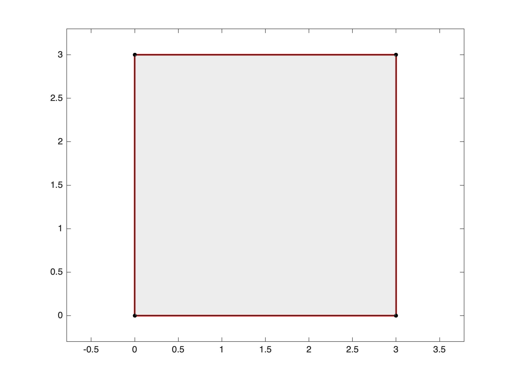


**Disc**

```matlab
domain = Domain('disc',3);
domain.disp;
```

```matlabTextOutput
Domain object
nodes (1):
     3     0

edges (1):
edge 1: from 1 to 1 param
 
area = 28.2715
 
```

```matlab
domain.plot;
```

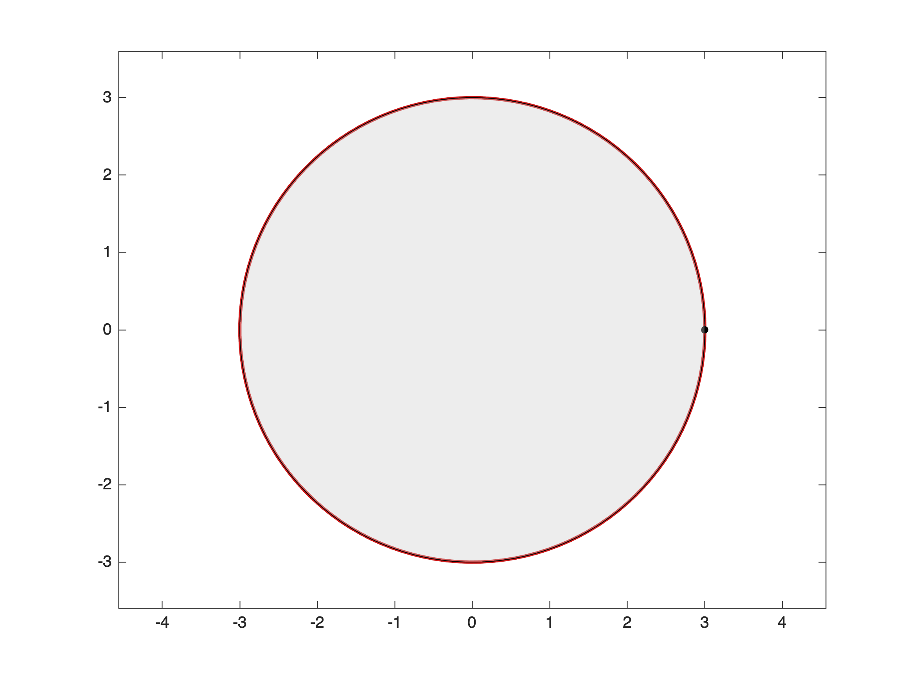


**Polygon**


Simply gives the nodes  Nx2 matrix in trigonometric order.

```matlab
nodes = [0 0; 2 0; 2 1;1 1;1 2;0 2];
domain = Domain(nodes);
domain.disp;
```

```matlabTextOutput
Domain object
nodes (6):
     0     0
     2     0
     2     1
     1     1
     1     2
     0     2

edges (6):
edge 1: from 1 to 2 straight
edge 2: from 2 to 3 straight
edge 3: from 3 to 4 straight
edge 4: from 4 to 5 straight
edge 5: from 5 to 6 straight
edge 6: from 6 to 1 straight
 
area = 3
 
```

```matlab
domain.plot;
```


You can make the edges and/or nodes numbering appear on the plot:

```matlab
subplot 131
domain.plot('edgelabels');
axis off

subplot 132
domain.plot('nodelabels');
axis off

subplot 133
domain.plot('labels');
axis off
```


### **2. Domains with curved edges**

You may use a parametric description of each curved edge using either a handle function of some expressions defining the parametric curve $t\mapsto \left(x\left(t\right),y\left(t\right)\right)$ depending on the parameter t . Always give the curve in trigonometric sense. 


**Half\-disc**


Define first some nodes as usual:

```matlab
nodes = [-1 0; 1 0];
```

Then define the edges as cells:

```matlab
f = @(t) [cos(t) sin(t)];
edge1 = {1,2};              % A straight edge
edge2 = {2,1,f,[0 pi]};     % A curved edge
edges = {edge1,edge2};
```

paying attention that the starting and ending points of the parametric curve match the indicated nodes. Then build the domain:

```matlab
domain = Domain(nodes,edges);
domain.disp;
```

```matlabTextOutput
Domain object
nodes (2):
    -1     0
     1     0

edges (2):
edge 1: from 1 to 2 straight
edge 2: from 2 to 1 param
 
area = 1.5708
 
```

```matlab
figure;
domain.plot('edgelabels');
```


**Parabolic domain**


You can also use expressions depending on the parameter t. 

```matlab
nodes = [0 0; 2 4;0 4];
edge1 = {1,2,{'t','t.^2'},[0,2]};
edge2 = {2,3};
edge3 = {3,1};
edges = {edge1,edge2,edge3};
domain = Domain(nodes,edges);
domain.plot('edgelabels');
```

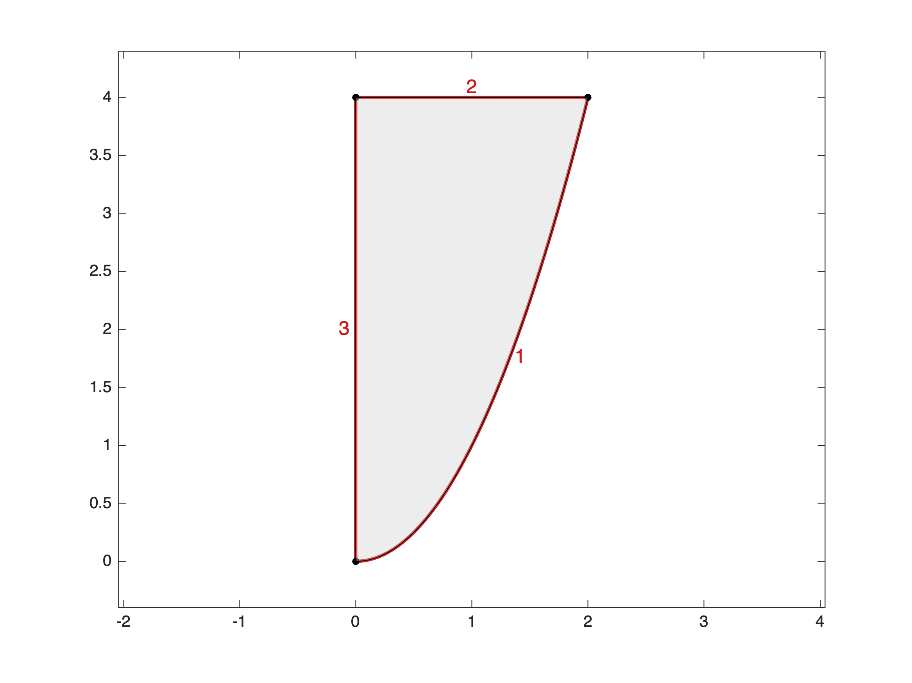


**Singular domains**


Outer singularity

```matlab
nodes = [0 0; 1 -1/2; 1 1/2];
edges = {{1,2,'t','-t.^2/2',[0,1]}
         {2,3}
         {3,1,'t','t.^4/2',[1,0]}};
domain = Domain(nodes,edges);
domain.plot('edgelabels');
```


 


Inner singularity

```matlab
nodes = [2 0 ; 0 0];
edge1 = {1,2,'cos(t).*(1+cos(t))', 'sin(t).*(1+cos(t))',[0 pi]};
edge2 = {2,1,'cos(t).*(1+cos(t))', 'sin(t).*(1+cos(t))',[pi 2*pi]};
domain = Domain(nodes,{edge1,edge2});
domain.plot('edgelabels');
```

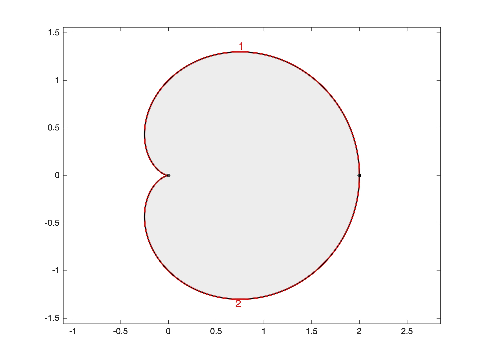


**Curved edges from intermediate edge nodes**


You can also define a curved edge using intermetiate edge nodes:

```matlab
nodes = [0 0 ; 1 0 ; 1 1 ; 0 1];

enodes = [1 1; 0.75 1.3; 0.5 1.4; 0.25 1.3; 0 1];
edges = {{1,2};{2,3};{3,4,enodes};{4,1}};

domain = Domain(nodes,edges);

domain.plot('edgelabels');
```

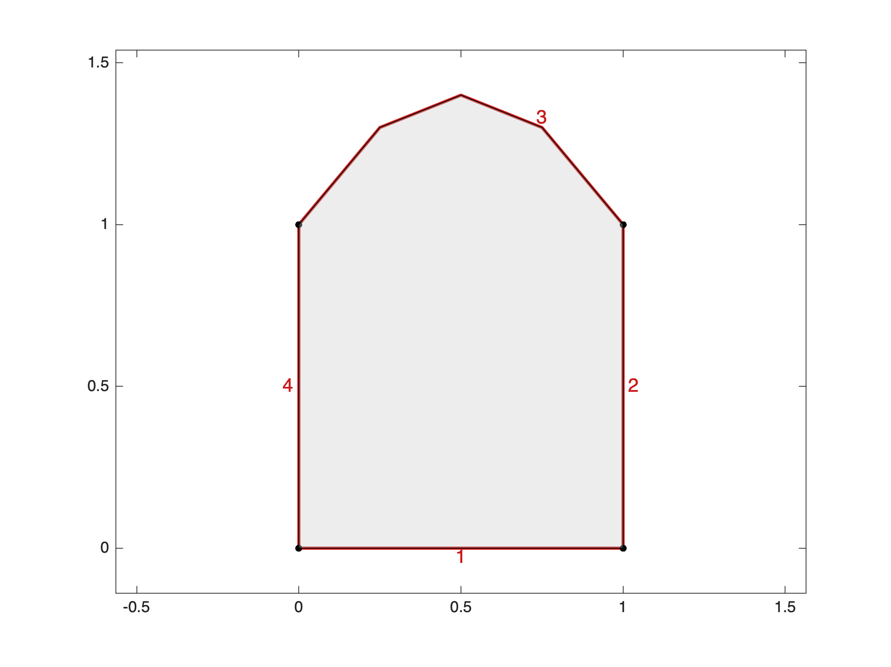


### **3. Domain with holes**

In order to create holes, you should add hole edges (straight or curved) in the trigonometric sense specifying that the domain is at its right side using the char parameter 'r' or 'R';


**Square domain with a circular hole**

```matlab
nodes = [-1 -1; 1 -1 ; 1 1; -1 1;0.5 0];
edges = {{1,2}
         {2,3}
         {3,4}
         {4,1}
         {5,5,'0.5*cos(t)','0.5*sin(t)',[0,2*pi],'r'}};
domain = Domain(nodes,edges);
domain.disp;
```

```matlabTextOutput
Domain object
nodes (5):
   -1.0000   -1.0000
1.0000   -1.0000
2. 0000    1.0000
   -1.0000    1.0000
    0.5000         0

edges (5):
edge 1: from 1 to 2 straight
edge 2: from 2 to 3 straight
edge 3: from 3 to 4 straight
edge 4: from 4 to 1 straight
edge 5: from 5 to 5 param, hole
 
area = 3.2147
 
```

```matlab
domain.plot('edgelabels');
```

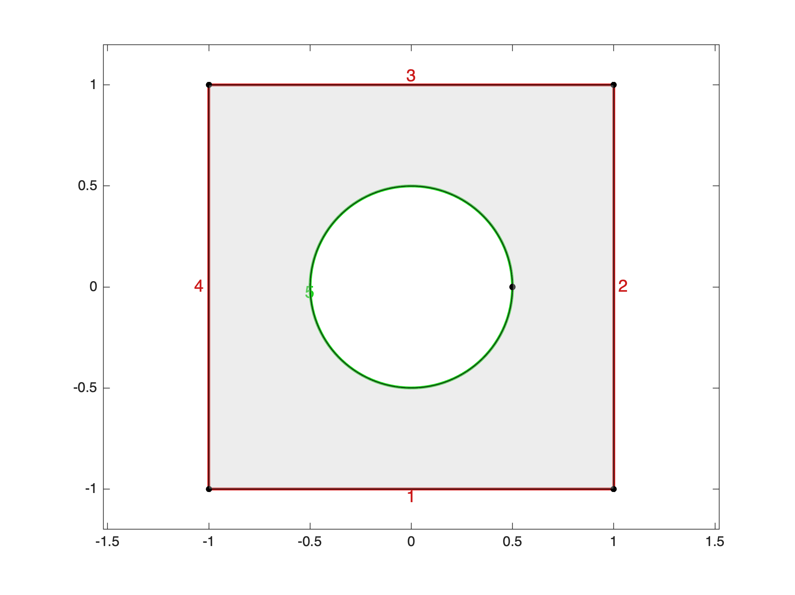

**Circular domain with a singular hole**

```matlab
nodes = [1.5 0;0 0; 1 -1/2; 1 1/2];
edges = {{1,1,'1.5*cos(t)','1.5*sin(t)',[0,2*pi]}
         {2,3,'t','-t.^2/2',[0,1],'R'}
         {3,4,'r'}
         {4,2,'t','t.^4/2',[1,0],'R'}};
domain = Domain(nodes,edges);
domain.plot('edgelabels');
```


### **4. Domain with inclusions and internal edges**

Similar to holes but we want now that the interior of the holes sto tay part of the domain. You just need to specify that the domain is both sides of the edges using the char parameter 'lr' or 'LR'. This kind of geometry will be used to generete a mesh inside and outside the inclusion. 


**Square with disc inclusion**

```matlab
nodes = [-1 -1; 1 -1 ; 1 1; -1 1;0.5 0 ; -0.5 0];
edges = {{1,2}
         {2,3}
         {3,4}
         {4,1}
         {5,6,'0.5*cos(t)','0.5*sin(t)',[0,pi],'lr'}
         {6,5,'0.5*cos(t)','0.5*sin(t)',[pi,2*pi],'lr'}};
domain = Domain(nodes,edges);
domain.plot('edgelabels');
```

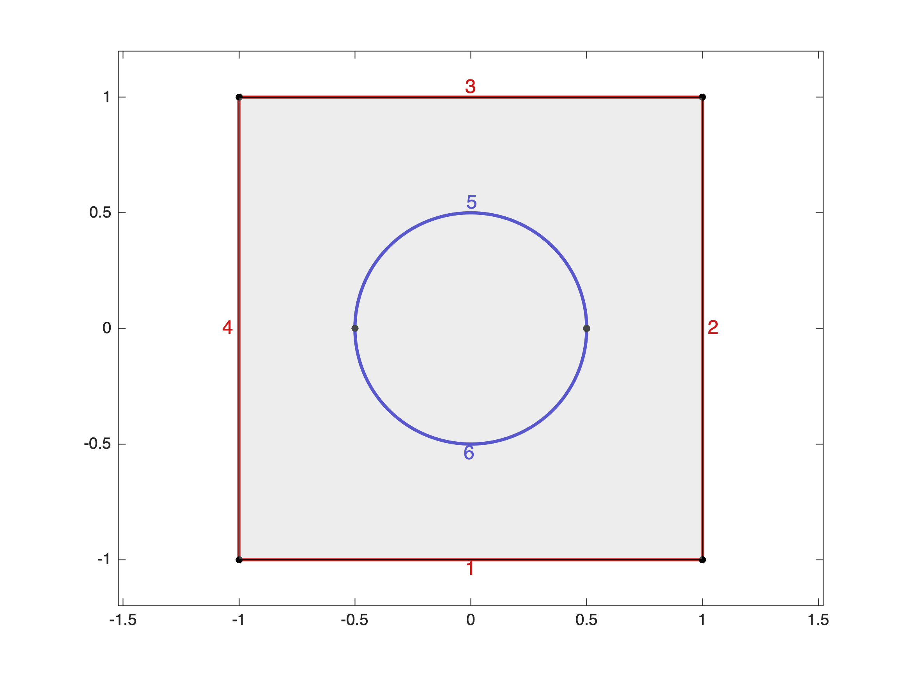


**Disc with cusp inclusion**

```matlab
nodes = [1.5 0;0 0; 1 -1/2; 1 1/2];
edges = {{1,1,'1.5*cos(t)','1.5*sin(t)',[0,2*pi]}
         {2,3,'t','-t.^2/2',[0,1],'lr'}
         {3,4,'lr'}
         {4,1,'t','t.^4/2',[0,1],'lr'}};
domain = Domain(nodes,edges);
domain.plot('edgelabels');
```

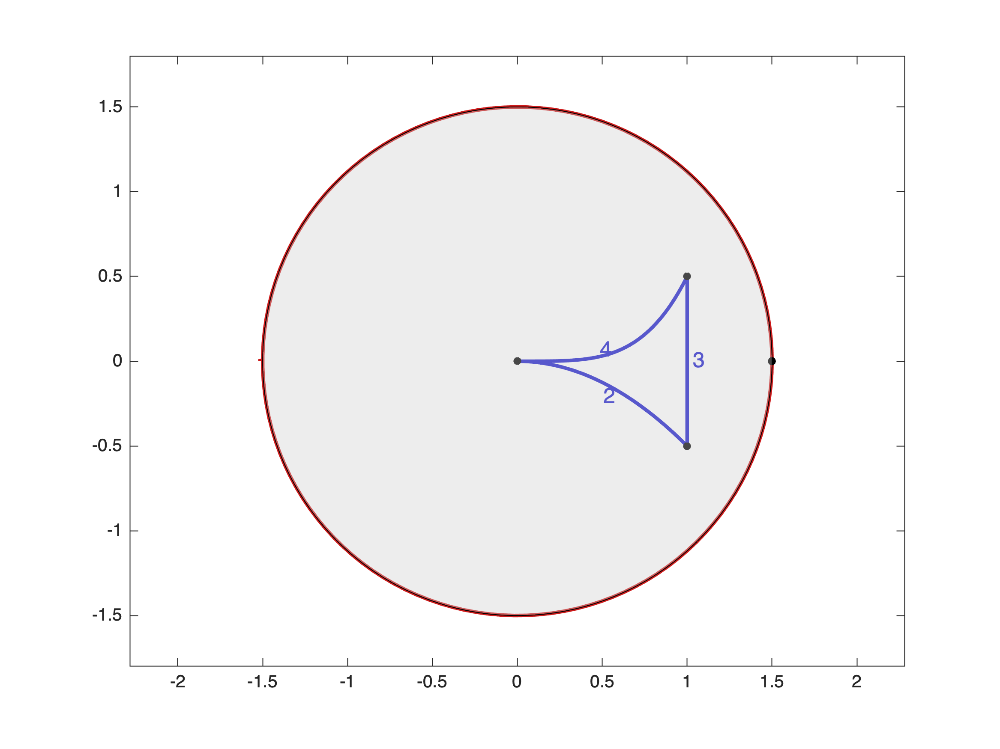


**Rectangle with internal egdges**

```matlab
nodes = [-3 -1;3 -1;3 1;-3 1;-2,-1;-2,1;2,-1;2,1];
edges = {{1,2},{2,3},{3,4},{4,1},{5,6,'lr'},{7,8,'lr'}};
domain = Domain(nodes,edges);
domain.disp;
```

```matlabTextOutput
Domain object
nodes (8):
    -3    -1
     3    -1
     3     1
    -3     1
    -2    -1
    -2     1
     2    -1
     2     1

edges (6):
edge 1: from 1 to 2 straight
edge 2: from 2 to 3 straight
edge 3: from 3 to 4 straight
edge 4: from 4 to 1 straight
edge 5: from 5 to 6 straight, internal
edge 6: from 7 to 8 straight, internal
 
area = 12
 
```

```matlab
domain.plot('edgelabels');
axis off;
```

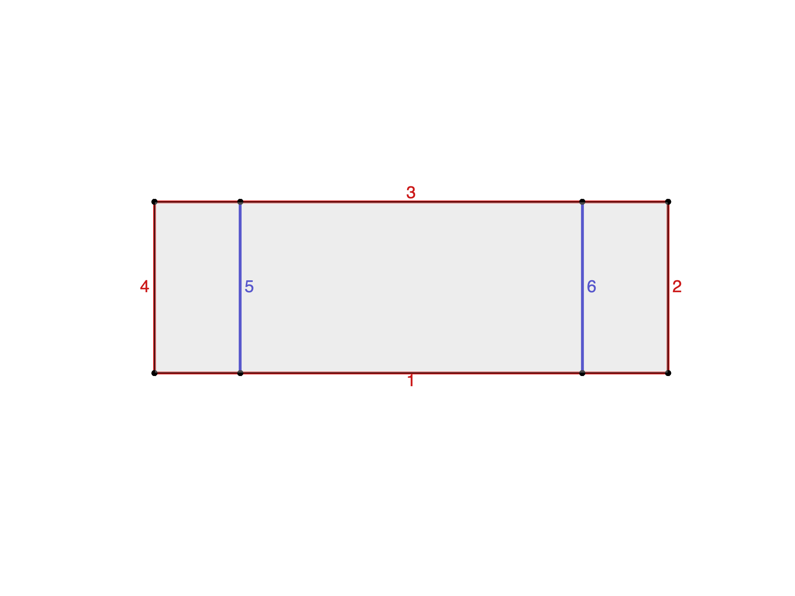


### **5. Domain from a binary image**

It is also possible to create a domain from a binary image. Create first a image matrix which values one inside the domain and zero outside. For exemple:


```matlab
I = double(imread('face.png'));
I = sum(I,3)/3/255;
I(I<0.5) = 0;
imagesc(I);
colorbar;
axis image; colormap gray;
```

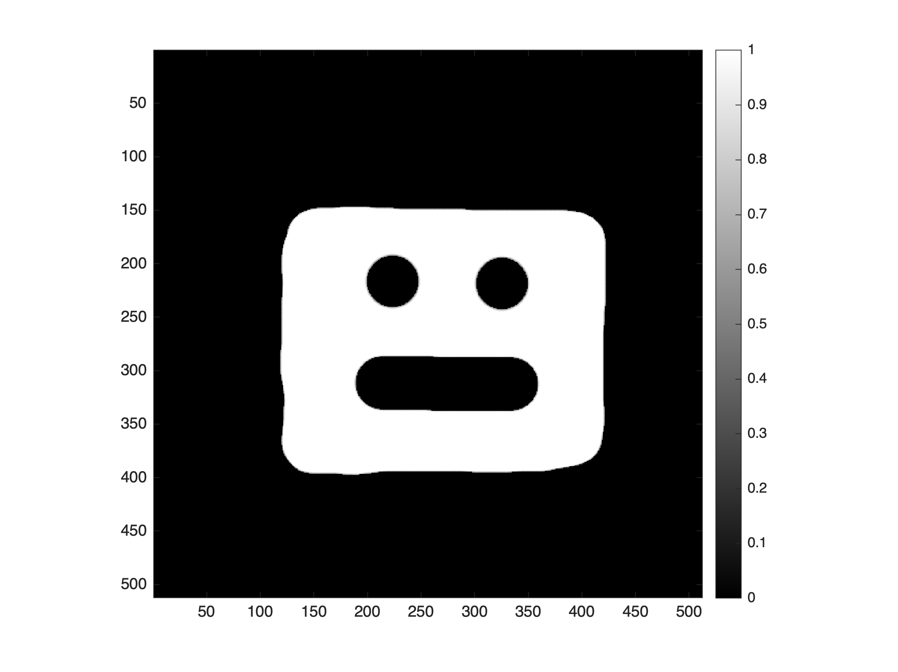

Then create the domain object:

```matlab
domain = Domain('image',I);
domain.plot;
```


Note that the constructor slighlty smooth the boundaries to a resolution of ~5 pixels and kills the smallest details. Undock the figure to see the domain details. 


Note also that you can fix the scale using a parameter dx that cooresponds to the pixel size of the image:


```matlab
dx = 0.1;
domain = Domain('image',I,dx);
domain.plot;
```


You can now create very complex domain such as the mediteranean sea with the main islands (undock the picture to see the details).

```matlab
I = double(imread('mediteranee.png'));
imagesc(I);
colorbar;
axis image; colormap gray;
```


```matlab
domain = Domain('image',I);
domain.plot;
```

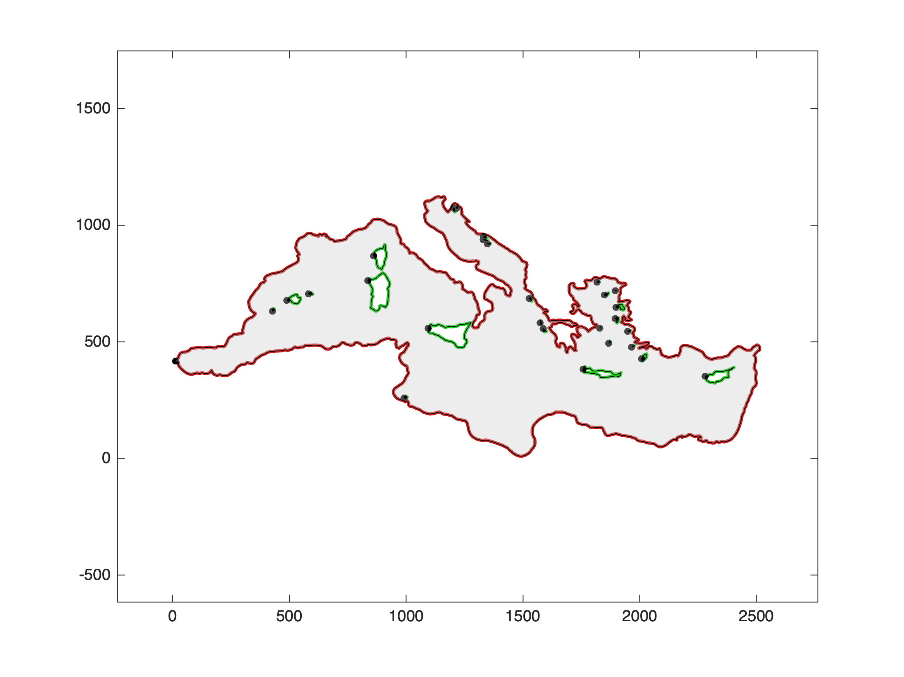
