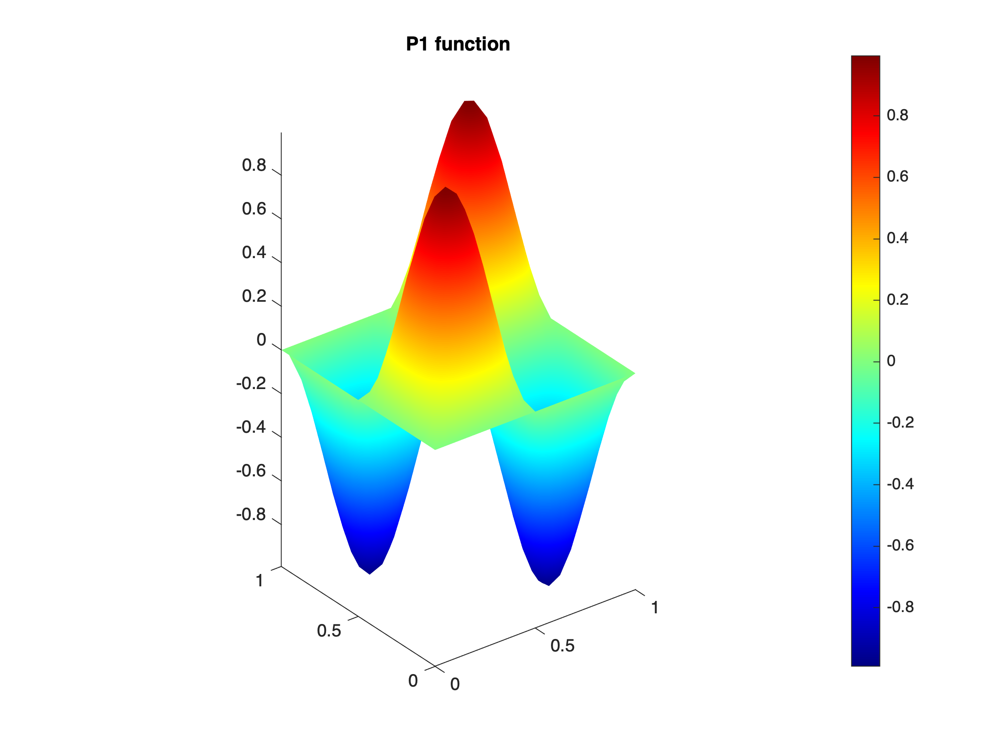
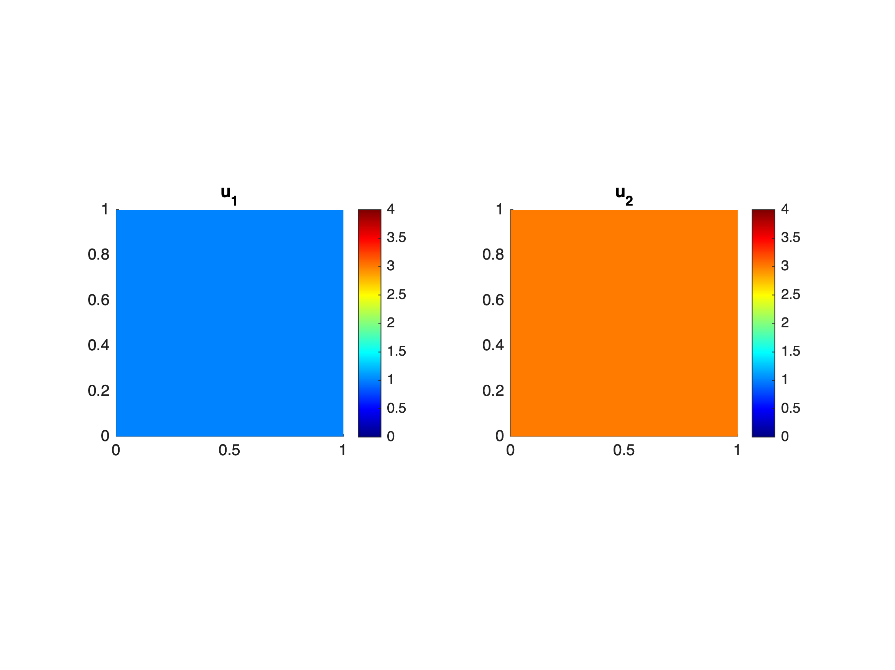

# **Functions definition and manipulation**

When a domain and a mesh are built, you can create and manipulate P0 and P1 functions defined on the mesh. 


P0 functions are constant in each mesh triangle.


P1 functions are continuous in the domain and linear in each triangle.

<a name="beginToc"></a>

## Table of Contents
&emsp;[1. Scalar functions](#1-scalar-functions)
 
&emsp;&emsp;[1.1 Constant functions](#1-1-constant-functions)
 
&emsp;&emsp;[1.2 Functions defined from an expression in x and y](#1-2-functions-defined-from-an-expression-in-x-and-y)
 
&emsp;&emsp;[1.3 Functions defined from a two variables handle function](#1-3-functions-defined-from-a-two-variables-handle-function)
 
&emsp;&emsp;[1.4 Function plots](#1-4-function-plots)
 
&emsp;&emsp;[1.5 Complex valued functions](#1-5-complex-valued-functions)
 
&emsp;[2. Vector fields](#2-vector-fields)
 
&emsp;&emsp;[2.1 Constant vector fields](#2-1-constant-vector-fields)
 
&emsp;&emsp;[2.1 Variable vector fields](#2-1-variable-vector-fields)
 
&emsp;[3. Matrix fields](#3-matrix-fields)
 
&emsp;&emsp;[3.1 Constant matrix fields](#3-1-constant-matrix-fields)
 
&emsp;&emsp;[3.2 Variable matrix fields](#3-2-variable-matrix-fields)
 
&emsp;[4. Integral calculus](#4-integral-calculus)
 
<a name="endToc"></a>

First build a domain and a mesh:

```matlab
domain = Domain('square');
mesh = Mesh(domain,0.05);
```

```matlabTextOutput
building mesh
building mesh properties
done
```

```matlab
mesh.plot;
```


# 1. Scalar functions

You can now construct constant P0 and P1 scalar functions using the class Mesh methods **mesh.P0** and **mesh.P1**.


## 1.1 Constant functions
```matlab
uP0 = mesh.P0(3);
uP1 = mesh.P1(3);
```

## 1.2 Functions defined from an expression in x and y

Write as an expression containting variable names x and y as input:

```matlab
uP0 = mesh.P0('sin(2*pi*x).*sin(2*pi*y)');
uP1 = mesh.P1('sin(2*pi*x).*sin(2*pi*y)');
```


## 1.3 Functions defined from a two variables handle function

Defines a handle function of two variables and use it as an input 

```matlab
f = @(x,y) sin(2*pi*x).*sin(2*pi*y);
uP0 = mesh.P0(f);
uP1 = mesh.P1(f);
```

## 1.4 Function plots
-  using **mesh.image**: 
```matlab
mesh.image(uP0);
title('P0 function')
```


```matlab
mesh.image(uP1);
title('P1 function')
axis image
```


-  using **mesh.surf:** 
```matlab
mesh.surf(uP0);
title('P0 function')
```


```matlab
mesh.surf(uP1);
title('P1 function')
```



## 1.5 Complex valued functions

A function can have complex values:

```matlab
u = mesh.P1('sin(x) + 1i*x.*y');
mesh.image(u)
```


# 2. Vector fields

A vector field is defined using the class Mesh methods mesh.P0 and mesh.P1. 

## 2.1 Constant vector fields
```matlab
u = mesh.P0(1,3);  
mesh.image(u);
```


If you want to have the same colorbar for the two compenents in the plot, just fix the clim:

```matlab
figure
cm = [0 4];
mesh.image(u,cm);
```



If the two component are the same: you can also define it specifying the tensorial order as 1. For example,

```matlab
u = mesh.P0(0,'order',1);
```

Defines the null vector field.

## 2.1 Variable vector fields
```matlab
u = mesh.P0('x','x+y'); 
figure
mesh.image(u);
```


# 3. Matrix fields
## 3.1 Constant matrix fields
```matlab
M = [0 1 ; 2 3];
u = mesh.P0(M);
mesh.image(u,[0 3]);
```


In order to build the identity matrix field, you can either use

```matlab
mesh.P0([1 0 ; 0 1]);
mesh.P0([1 0 0 1]);
mesh.P0(1,'order',2);
```


## 3.2 Variable matrix fields

You can build your matrix field giving 4 input mixing constants, expressions in x,y,  handle function of two variables and data vectors. For example: 

```matlab
fu3 = @(x,y) sin(2*pi*y);
u4 = rand(mesh.Ntriangles,1);
u = mesh.P0(1,'x',fu3,u4);
figure
mesh.image(u);
```


If you give only two arguments and specify the order two, you get a diagonal matrix field:

```matlab
u = mesh.P0(1,2,'order',2);
figure
mesh.image(u,[0 2]);
```


If you give only trhee arguments and specify the order two, you get a symmetric matrix field:

```matlab
u = mesh.P0(1,2,'x','order',2);
figure
mesh.image(u,[0,2]);
```


# 4. Integral calculus

You can compute the integral of any function (tensor field) in the domain using the Mesh method **mesh.integral**. Input can be either P0 or P1 function or some expression in x,y or handle function of two variables. 

```matlab
mesh.integral('x.^2+y.^2')
```

```matlabTextOutput
ans = 0.6667
```

```matlab
u = mesh.P1('x','x.*y');
mesh.integral(u)
```

```matlabTextOutput
ans = 1x2
    0.5000    0.2500

```

```matlab
u = mesh.P0('x','x.*y',3,@(x,y) x+y);
mesh.integral(u)
```

```matlabTextOutput
ans = 1x4
    0.5000    0.2500    3.0000    1.0000

```
