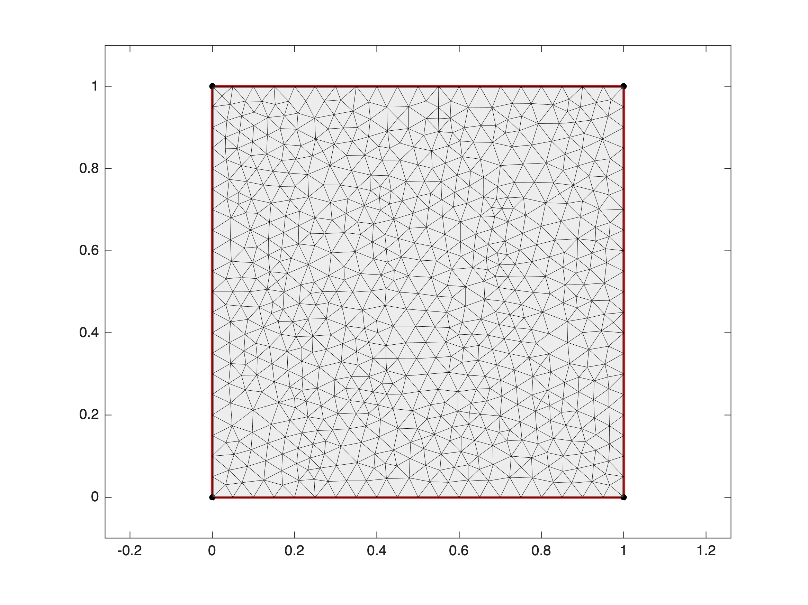
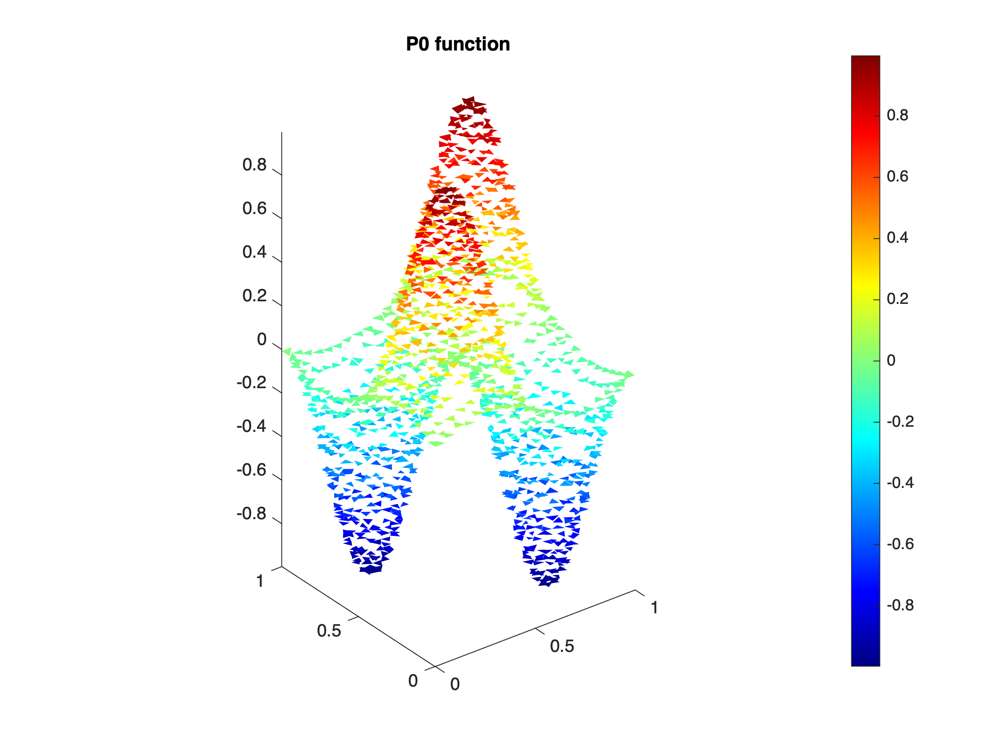
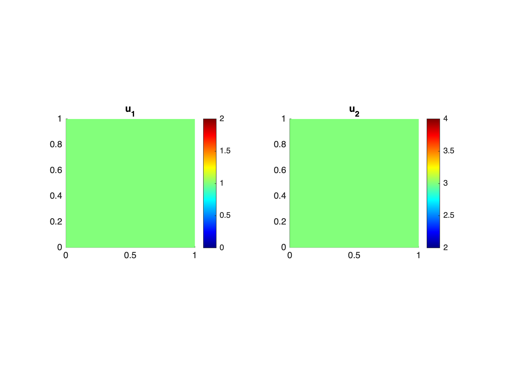

# **Functions definition and manipulation**

When a domain and a mesh are built, you can create and manipulate P0 and P1 functions defined on the mesh. 


P0 functions are constant in each mesh triangle.


P1 functions are continuous in the domain and linear in each triangle.

<a name="beginToc"></a>

## Table of Contents
&emsp;[1. Scalar functions](#1-scalar-functions)
 
&emsp;&emsp;[**1.1 Constant functions**](#-textbf-1-1-constant-functions-)
 
&emsp;&emsp;[**1.2 Functions defined from an expression in x and y**](#-textbf-1-2-functions-defined-from-an-expression-in-x-and-y-)
 
&emsp;&emsp;[**1.3 Functions defined from a two variables handle function**](#-textbf-1-3-functions-defined-from-a-two-variables-handle-function-)
 
&emsp;&emsp;[1.4 Function plots](#1-4-function-plots)
 
&emsp;&emsp;[1.5 Complex valued functions](#1-5-complex-valued-functions)
 
&emsp;[2. Vector fields](#2-vector-fields)
 
&emsp;&emsp;[2.1 Constant vector fields](#2-1-constant-vector-fields)
 
&emsp;&emsp;[**2.2 Variable vector fields**](#-textbf-2-2-variable-vector-fields-)
 
&emsp;[3. Matrix and tensor fields](#3-matrix-and-tensor-fields)
 
&emsp;[4. Integral calculus](#4-integral-calculus)
 
<a name="endToc"></a>

First build a domain and a mesh:

```matlab
domain = Domain('square');
mesh = Mesh(domain,0.05);
```

```matlabTextOutput
building mesh
building mesh properties
done
```

```matlab
mesh.plot;
```



# 1. Scalar functions

You can now construct constant P0 and P1 scalar functions using the class Mesh methods mesh.P0 and mesh.P1.


## **1.1 Constant functions**
```matlab
uP0 = mesh.P0(3);
uP1 = mesh.P1(3);
```

## **1.2 Functions defined from an expression in x and y**

Write as an expression containting variable names x and y as input:

```matlab
uP0 = mesh.P0('sin(2*pi*x).*sin(2*pi*y)');
uP1 = mesh.P1('sin(2*pi*x).*sin(2*pi*y)');
```


## **1.3 Functions defined from a two variables handle function**

Defines a handle function of two variables and use it as an input 

```matlab
f = @(x,y) sin(2*pi*x).*sin(2*pi*y);
uP0 = mesh.P0(f);
uP1 = mesh.P1(f);
```

## 1.4 Function plots
-  using mesh.surf: 
```matlab
mesh.surf(uP0);
title('P0 function')
```


```matlab
mesh.surf(uP1);
title('P1 function')
axis image
```


-  using mesh.image 
```matlab
mesh.image(uP0);
title('P0 function')
```



```matlab
mesh.image(uP1);
title('P1 function')
```


## 1.5 Complex valued functions

A function can have complex values:

```matlab
u = mesh.P1('sin(x) + 1i*x.*y');
mesh.image(u)
```


# 2. Vector fields

A vector field is defined using the class Mesh methods mesh.P0 and mesh.P1. 

## 2.1 Constant vector fields
```matlab
v = mesh.P0(1,3);  % Or equivalently mesh.P0([1;3]) or mesh.P0([1 3])
mesh.image(v);
```

If you want to have the same colorbar for the two compenents in the plot, just fix the clim:

```matlab
clim = [0 4];
mesh.image(v,clim);
```

If the two component are the same: you can also define it specifying the tensorial order as 1. For example,

```matlab
v = mesh.P0(0,'order',1);
```

defines the null vector field.

## **2.2 Variable vector fields**

In the same manner than scalar functions, we can use either exmpression in x,y or hanlde functions of two variables:

```matlab
v = mesh.P0('x','y');
mesh.image(v);
```

```matlab
v = mesh.P1(@(x,y) [sin(2*pi*x) sin(2*pi*y)]);
mesh.image(v);
```

```matlab
v = mesh.P1(3,'x.^2+y.^2');
mesh.image(v);
```

```matlab
v = mesh.P0('x',@(x,y) sin(2*pi*y));
mesh.image(v);
```



# 3. Matrix and tensor fields

# 4. Integral calculus

You can compute the integral of any function in you domain using the Mesh method **mesh.intergal**. Input can be either a P0 or P1 function or some expression in x,y or handle function of two variables. 

```matlab
u = mesh.P0('x + y');
mesh.integral(u)
```

```matlabTextOutput
ans = 1.0000
```

```matlab
u = mesh.P1('x.*y');
mesh.integral(u)
```

```matlabTextOutput
ans = 0.2500
```

```matlab
mesh.integral('x.^2+y.^2')
```

```matlabTextOutput
ans = 0.6667
```

```matlab
f = @(x,y) sin(2*pi*x).*sin(2*pi*y);
mesh.integral(f)
```

```matlabTextOutput
ans = 1.0156e-07
```

Note that the integration method is of order 2 in case of a domain with curved boundaries and of order 3 in polygonal domains (exact for polynomials of degree 2).  Check the following test:

```matlab
abs(mesh.integral('1') - 1)
```

```matlabTextOutput
ans = 0
```

```matlab
abs(mesh.integral('x') - 1/2)
```

```matlabTextOutput
ans = 0
```

```matlab
abs(mesh.integral('y') - 1/2)
```

```matlabTextOutput
ans = 5.5511e-17
```

```matlab
abs(mesh.integral('x.^2') - 1/3)
```

```matlabTextOutput
ans = 5.5511e-17
```

```matlab
abs(mesh.integral('y.^2') - 1/3)
```

```matlabTextOutput
ans = 1.1102e-16
```

```matlab
abs(mesh.integral('x.*y') - 1/4)
```

```matlabTextOutput
ans = 8.3267e-17
```
