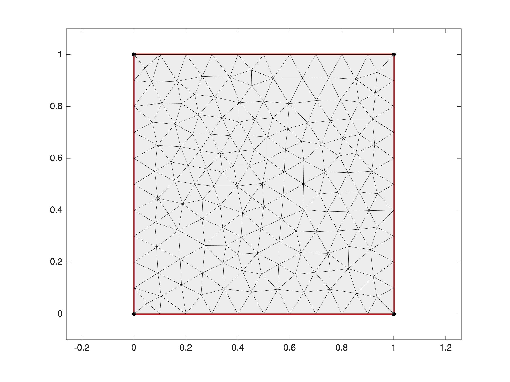
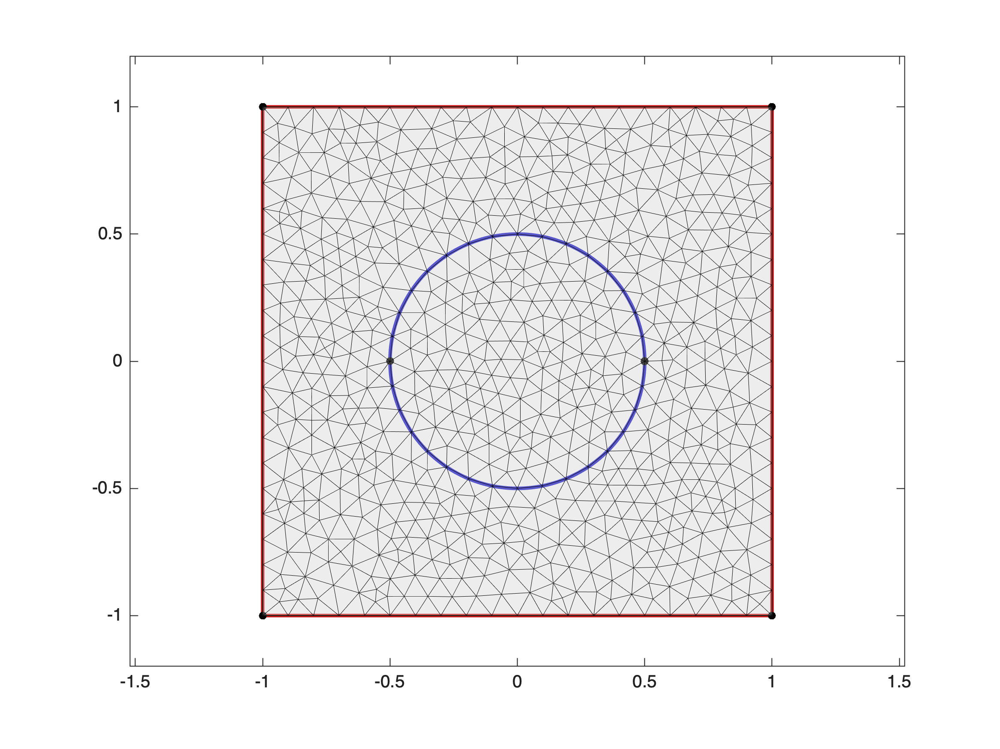
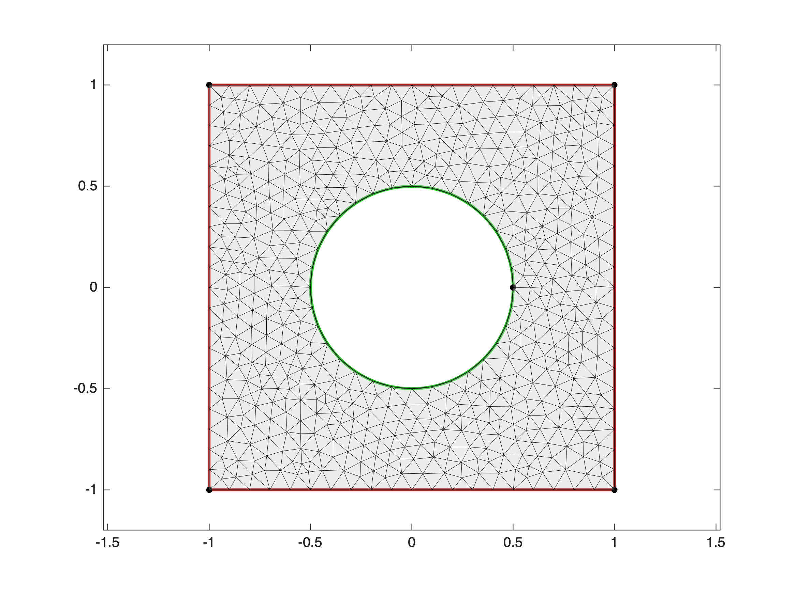
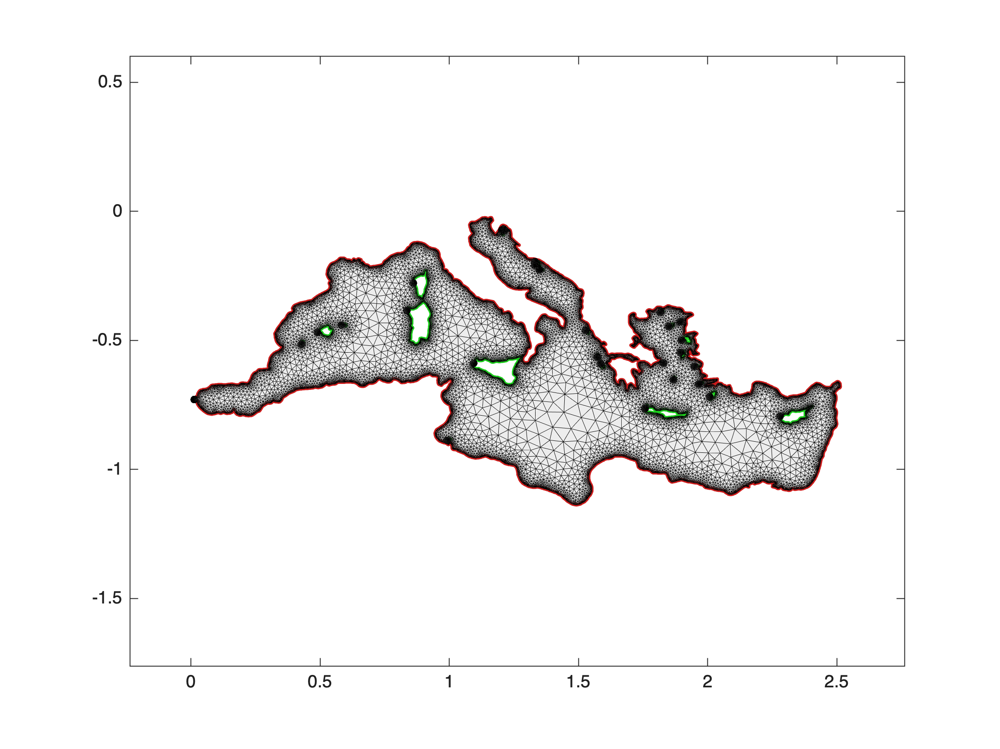

# **Mesh**

Mesh object 


 Standard construction:


 **mesh = Mesh(domain,h)** where domain is a Domain object and h is the requested mesh resolution. 


 **mesh = Mesh(domain,h,h\_bound)** where h\_bound is the requested mesh resolution at the bounary. 


 **mesh = Mesh(domain,h,'save')** allows to save large meshes if it is large or load it if previousely saved. 

<a name="beginToc"></a>

## Table of Contents
&emsp;[**1. Basic use**](#-textbf-1-basic-use-)
 
&emsp;[**2. Example of meshes**](#-textbf-2-example-of-meshes-)
 
&emsp;[3. Mesh from a binary image](#3-mesh-from-a-binary-image)
 
&emsp;[4. The 'save' option](#4-the-save-option)
 
<a name="endToc"></a>

# **1. Basic use**

To create a Mesh object form a domain object

```matlab
domain = Domain('square');
```

just run

```matlab
mesh = Mesh(domain,0.1);
```

```matlabTextOutput
building mesh
building mesh properties
done
```

then check the result

```matlab
mesh.disp;
```

```matlabTextOutput
Mesh object
nodes :           175
triangles :       308
h (input) :       0.1
h_bound (input) : 0.1
min edge size :   0.050061
max edge size :   0.12176
mean edge size :  0.086953
edge size std :   0.013321
min quality :     0.71517
mean quality :    0.9665
memory (kB) :     103
Build time (s) :  0.19
 
```

```matlab
mesh.plot;
```




You can recover the nodes and the triangles with

```matlab
mesh.nodes
```

```matlabTextOutput
ans = 175x2
         0         0
    0.1000         0
    0.2000         0
    0.3000         0
    0.4000         0
    0.5000         0
    0.6000         0
    0.7000         0
    0.8000         0
    0.9000         0

```

```matlab
mesh.triangles
```

```matlabTextOutput
ans = 308x3
    81   116    33
    30    45   116
    35   103   126
   137    87    48
    37    75   119
   100     8     9
   115     2     3
    96    57    80
    77     6     7
   145    16   105

```

If needed you can specify the mesh resolution at the boundary: 

```matlab
h = 0.1;
h_bound = 0.01;
mesh = Mesh(domain,h,h_bound);
```

```matlabTextOutput
building mesh
building mesh properties
done
```

```matlab
mesh.plot;
```


# **2. Example of meshes**

**Disc**

```matlab
domain = Domain('disc',3);
mesh = Mesh(domain,0.5);
```

```matlabTextOutput
building mesh
building mesh properties
done
```

```matlab
mesh.plot;
```


**Polygon**

```matlab
nodes = [0 0; 2 0; 2 1;1 1;1 2;0 2];
domain = Domain(nodes);
mesh = Mesh(domain,0.1);
```

```matlabTextOutput
building mesh
building mesh properties
done
```

```matlab
mesh.plot;
```


 


**Half\-disc**

```matlab
nodes = [-1 0; 1 0];
f = @(t) [cos(t) sin(t)];
edge1 = {1,2}; 
edge2 = {2,1,f,[0 pi]};
edges = {edge1,edge2};
domain = Domain(nodes,edges);
mesh = Mesh(domain,0.1);
```

```matlabTextOutput
building mesh
building mesh properties
done
```

```matlab
mesh.plot;
```


**Parabolic domain**


You can also use expressions depending on the parameter t. 

```matlab
nodes = [0 0; 2 4;0 4];
edge1 = {1,2,{'t','t.^2'},[0,2]};
edge2 = {2,3};
edge3 = {3,1};
edges = {edge1,edge2,edge3};
domain = Domain(nodes,edges);

mesh = Mesh(domain,0.2);
```

```matlabTextOutput
building mesh
building mesh properties
done
```

```matlab
mesh.plot;
```


**Singular domains**


Outer singularity

```matlab
nodes = [0 0; 1 -1/2; 1 1/2];
edges = {{1,2,'t','-t.^2/2',[0,1]}
         {2,3}
         {3,1,'t','t.^4/2',[1,0]}};
domain = Domain(nodes,edges);

mesh = Mesh(domain,0.05);
```

```matlabTextOutput
building mesh
building mesh properties
done
```

```matlab
mesh.plot;
```


 


Inner singularity

```matlab
nodes = [2 0 ; 0 0];

edge1 = {1,2,'cos(t).*(1+cos(t))', 'sin(t).*(1+cos(t))',[0 pi]};
edge2 = {2,1,'cos(t).*(1+cos(t))', 'sin(t).*(1+cos(t))',[pi 2*pi]};

domain = Domain(nodes,{edge1,edge2});

mesh = Mesh(domain,0.1);
```

```matlabTextOutput
building mesh
building mesh properties
done
```

```matlab
mesh.plot;
```


**Curved edges from intermediate edge nodes**


You can also define a curved edge using intermetiate edge nodes:

```matlab
nodes = [0 0 ; 1 0 ; 1 1 ; 0 1];
enodes = [1 1; 0.75 1.3; 0.5 1.4; 0.25 1.3; 0 1];
edges = {{1,2};{2,3};{3,4,enodes};{4,1}};
domain = Domain(nodes,edges);
mesh = Mesh(domain,0.05);
```

```matlabTextOutput
building mesh
building mesh properties
done
```

```matlab
mesh.plot;
```


Similar to holes but we want now that the interior of the holes sto tay part of the domain. You just need to specify that the domain is both sides of the edges using the char parameter 'lr' or 'LR'. This kind of geometry will be used to generete a mesh inside and outside the inclusion. 


**Square with disc inclusion**

```matlab
nodes = [-1 -1; 1 -1 ; 1 1; -1 1;0.5 0 ; -0.5 0];
edges = {{1,2}
         {2,3}
         {3,4}
         {4,1}
         {5,6,'0.5*cos(t)','0.5*sin(t)',[0,pi],'lr'}
         {6,5,'0.5*cos(t)','0.5*sin(t)',[pi,2*pi],'lr'}};
domain = Domain(nodes,edges);

mesh = Mesh(domain,0.1);
```

```matlabTextOutput
building mesh
building mesh properties
done
```

```matlab
mesh.plot;
```




**Disc with cusp inclusion**

```matlab
nodes = [1.5 0;0 0; 1 -1/2; 1 1/2];
edges = {{1,1,'1.5*cos(t)','1.5*sin(t)',[0,2*pi]}
         {2,3,'t','-t.^2/2',[0,1],'lr'}
         {3,4,'lr'}
         {4,1,'t','t.^4/2',[0,1],'lr'}};

domain = Domain(nodes,edges);

mesh = Mesh(domain,0.2);
```

```matlabTextOutput
building mesh
building mesh properties
done
```

```matlab
mesh.plot;
```


**Rectangle with internal egdges**

```matlab
nodes = [-3 -1;3 -1;3 1;-3 1;-2,-1;-2,1;2,-1;2,1];
edges = {{1,2},{2,3},{3,4},{4,1},{5,6,'lr'},{7,8,'lr'}};

domain = Domain(nodes,edges);

mesh = Mesh(domain,0.2);
```

```matlabTextOutput
building mesh
building mesh properties
done
```

```matlab
mesh.plot;
```


**Square domain with a circular hole**

```matlab
nodes = [-1 -1; 1 -1 ; 1 1; -1 1;0.5 0];

edges = {{1,2}
         {2,3}
         {3,4}
         {4,1}
         {5,5,'0.5*cos(t)','0.5*sin(t)',[0,2*pi],'r'}};

domain = Domain(nodes,edges);

mesh = Mesh(domain,0.1);
```

```matlabTextOutput
building mesh
building mesh properties
done
```

```matlab
mesh.plot;
```




**Circular domain with a singular hole**

```matlab
nodes = [1.5 0;0 0; 1 -1/2; 1 1/2];

edges = {{1,1,'1.5*cos(t)','1.5*sin(t)',[0,2*pi]}
         {2,3,'t','-t.^2/2',[0,1],'R'}
         {3,4,'r'}
         {4,2,'t','t.^4/2',[1,0],'R'}};

domain = Domain(nodes,edges);

mesh = Mesh(domain,0.1);
```

```matlabTextOutput
building mesh
building mesh properties
done
```

```matlab
mesh.plot;
```


# 3. Mesh from a binary image

First get a binary image of your domain:

```matlab
I = double(imread('face.png'));
I = sum(I,3)/3/255;
I(I<0.5) = 0;

imagesc(I);
colorbar;
axis image; colormap gray;
```


Then create the domain object:

```matlab
domain = Domain('image',I,1/512);
```

then mesh it:

```matlab
mesh = Mesh(domain,0.02);
```

```matlabTextOutput
building mesh
building mesh properties
done
```

```matlab
mesh.plot;
```


You can now create very complex domains such as the mediteranean sea with the main islands (undock the picture to see the details).

```matlab
I = double(imread('mediteranee.png'));
imagesc(I);
colorbar;
axis image; colormap gray;
```


```matlab
domain = Domain('image',I,1/1000);
domain.plot;
```


```matlab
mesh = Mesh(domain,0.1,0.002);
```

```matlabTextOutput
building mesh
building mesh properties
done
```

```matlab
mesh.plot;
```



```matlab
mesh.disp;
```

```matlabTextOutput
Mesh object
nodes :           14479
triangles :       25916
h (input) :       0.1
h_bound (input) : 0.002
min edge size :   0.00060147
max edge size :   0.072231
mean edge size :  0.0079473
edge size std :   0.0063625
min quality :     0.26936
mean quality :    0.9479
memory (kB) :     8513
Build time (s) :  3.17
 
```

# 4. The 'save' option

For large meshes (more than 20k triangles), use the 'save' option to save it and load it in subsequent calls. This higly reduce the running time of your script. 


Here is an example: 

```matlab
domain = Domain('square');
tic;
mesh = Mesh(domain,0.005);
```

```matlabTextOutput
building mesh
Warning: Approximately 80000 triangles will be generated.
building mesh properties
done
```

```matlab
toc
```

```matlabTextOutput
Elapsed time is 7.876267 seconds.
```

This mesh is long to build. Use instead:

```matlab
tic;
mesh = Mesh(domain,0.005,'save');
```

```matlabTextOutput
looking for existing mesh
mesh found
load saved_meshes/mesh2.mat
```

```matlab
toc
```

```matlabTextOutput
Elapsed time is 0.378906 seconds.
```

First call saves the mesh in *saved\_meshes* directory. All subsequent calls just load it. 

