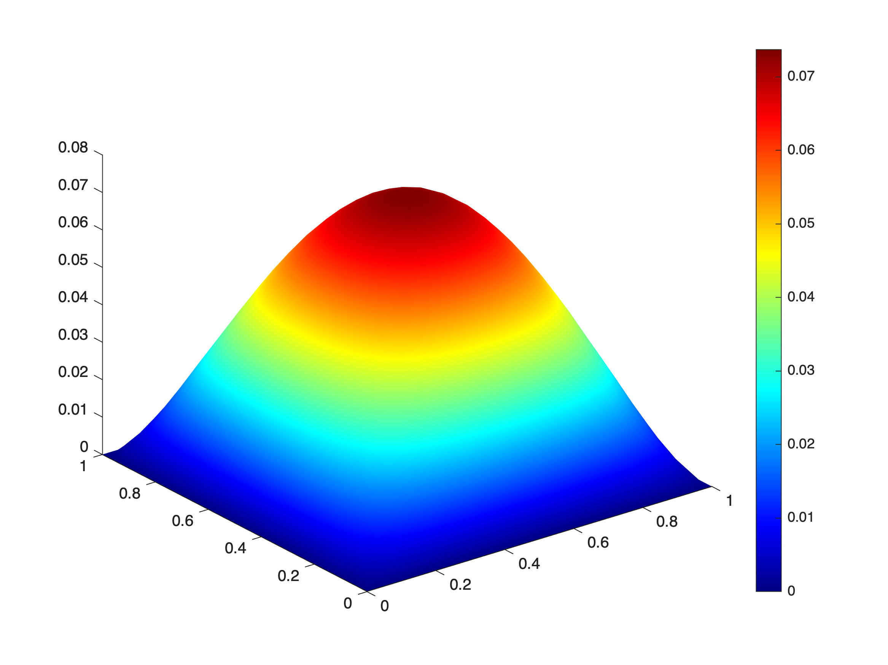
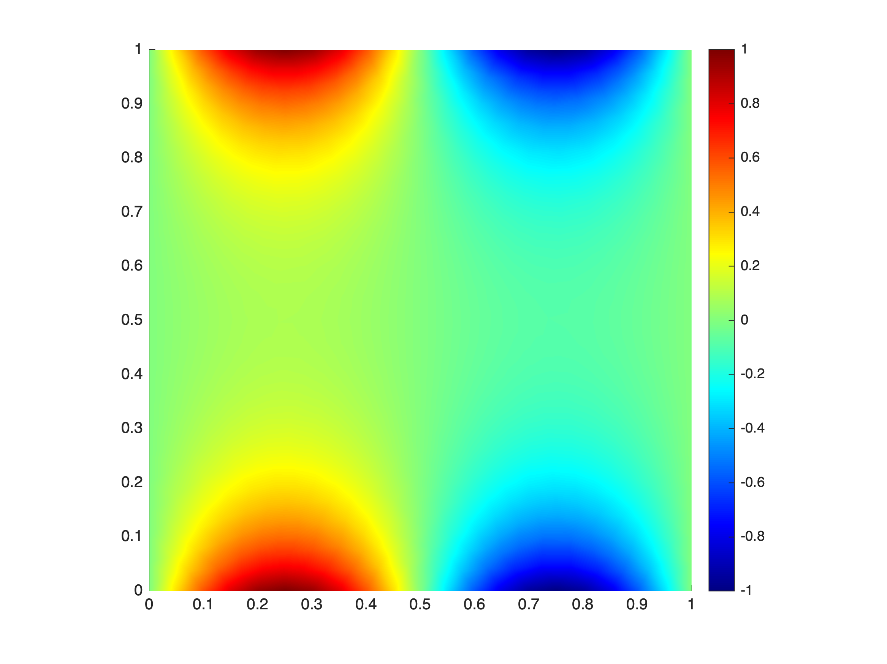

# **Scalar Ellipitic PDEs solver**

<a name="beginToc"></a>

## Table of Contents
&emsp;[1. The mesh.solve method](#1-the-mesh-solve-method)
 
&emsp;[1. Basic example: the Poisson equation](#1-basic-example-the-poisson-equation)
 
<a name="endToc"></a>

# 1. The mesh.solve method

 The mesh.sove methods allows to quickly solve any scalar elliptic PDE of the form

 $$ -\mathrm{div}\left(a\nabla \;u\right)+\mathit{\mathbf{b}}\cdot \nabla \;u+c\;u\;=f\;\;\mathrm{in}\;\Omega , $$ 

with various boundary conditions. 


The code reads simply **mesh.solve(a,b,c,f,bc\_list)**


The inputs a, b, c, and f are interpreted as P0 tensor fields in the domain.


The format for the boundary conditions is 


 **bc = {I,'dir',g}** for Dicihlet 


 **bc = {I,'neu',g}** for Neumann


 **bc = {I,'rob',g,h}** for Robin


Where  **I** is the indices of the domain edges xhere the condition applies. The boundary functions can be any expression in x,y, handle functions of two varaibles or P0, P1, P0bound functions. 


# 1. Basic example: the Poisson equation

We consider the Poisson problem in the unit square $\Omega :={\left(0,1\right)}^{\;2} :$ 

 $$ \left\lbrace \begin{array}{ll} -\Delta u=f\;\;\; & \mathrm{in}\;\Omega ,\newline \;\;\;\;\;\;\;u=0 & \mathrm{on}\;\partial \Omega \ldotp  \end{array}\right. $$ 

```matlab
domain = Domain('square');
mesh = Mesh(domain,0.05);
```

```matlabTextOutput
building mesh
building mesh properties
done
```

We fix $a=1,\mathit{\mathbf{b}}=0,c=0,\mathrm{and}\;f=1$ . We then set the Dirichlet boundary condition.

```matlab
bc = {1:4,'dir',0};
u = mesh.solve(1,0,0,1,bc); 
```

The output solution is a P1 function (see doc\_functions.mlx). You can now plot it:

```matlab
mesh.surf(u);
```



We consider the Poisson problem with non\-homogeneous Dirichlet condition:

 $$ \left\lbrace \begin{array}{ll} -\Delta u=0\;\; & \mathrm{in}\;\Omega ,\newline \;\;\;\;\;\;\;u=g & \mathrm{on}\;\partial \Omega \ldotp  \end{array}\right. $$ 

```matlab
bc = {1:4,'dir','sin(2*pi*x)'};
u = mesh.solve(1,0,0,0,bc);
mesh.image(u); 
```


